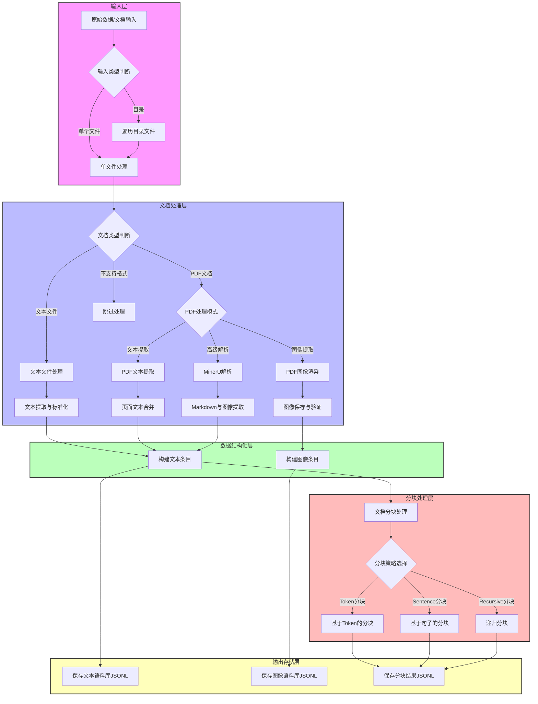

# UltraRAG 数据处理与文档解析工作流程

## 流程说明

### 1. 输入层
- 支持单个文件或整个目录作为输入源
- 自动遍历目录中的所有文件进行处理

### 2. 文档处理层
- 根据文件类型选择不同的处理分支
- 文本文件(.txt, .md)直接读取并标准化
- PDF文档支持三种处理模式：
  - 文本提取：使用pymupdf提取文本内容
  - 图像提取：渲染PDF页面为图像并保存
  - 高级解析：使用MinerU工具进行深度解析

### 3. 数据结构化层
- 将提取的内容转换为统一的数据条目格式
- 文本条目包含ID、标题和内容
- 图像条目包含ID、图像ID和图像路径

### 4. 分块处理层
- 对文本内容进行分块以优化后续检索
- 支持三种分块策略：
  - Token分块：基于token数量进行分块
  - Sentence分块：基于句子边界进行分块
  - Recursive分块：使用递归策略进行智能分块

### 5. 输出存储层
- 将处理结果保存为JSONL格式，便于后续处理
- 分别保存文本语料库、图像语料库和分块结果