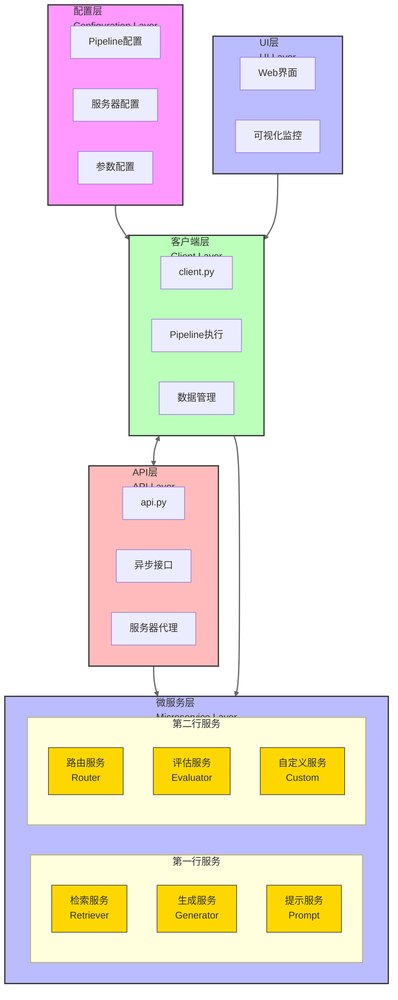
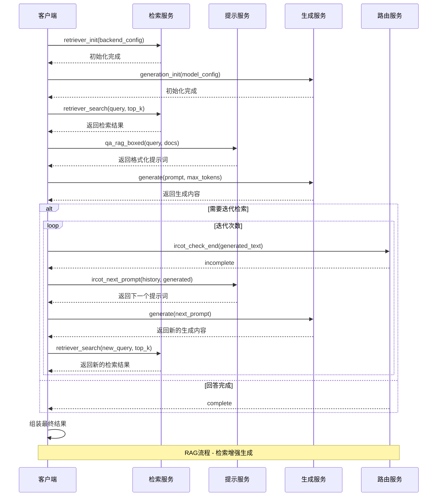
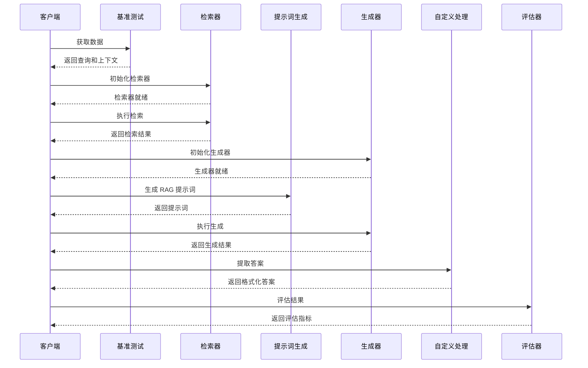
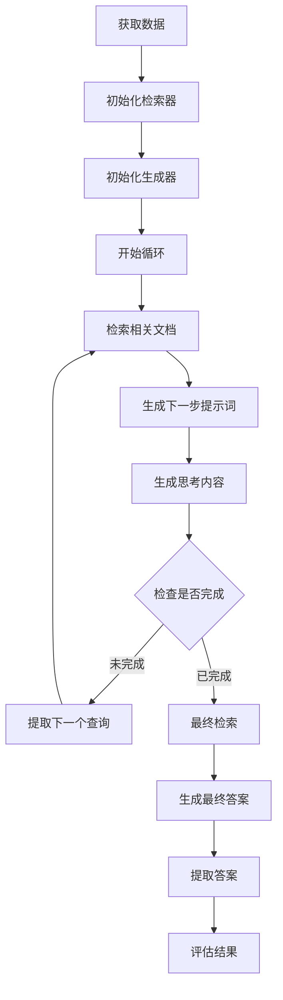

# UltraRAG 项目技术分析报告

## 1. 项目概述

UltraRAG 是一个灵活、可扩展的检索增强生成（RAG）框架，采用模块化微服务架构设计，支持多种高级检索策略和生成模型。

- **模块化设计**：采用微服务架构，将不同功能组件分离为独立服务器
- **灵活配置**：通过 YAML 文件配置 Pipeline，支持循环和分支控制
- **多后端支持**：支持多种检索后端（如 infinity、sentence_transformers、openai、bm25）和生成后端（vllm、openai、hf）
- **高级流程控制**：支持迭代检索、条件分支和复杂推理流程

## 2. 项目结构

```
UltraRAG/
├── .env.dev              # 开发环境变量配置
├── Dockerfile            # Docker 构建配置
├── README.md             # 项目说明文档
├── data/                 # 数据存储目录
├── docs/                 # 项目文档
├── examples/             # Pipeline 配置示例
│   ├── rag.yaml          # 基础 RAG 流程
│   ├── IRCoT.yaml        # 迭代检索链思考流程
│   ├── IterRetGen.yaml   # 迭代检索生成流程
│   └── ...
├── prompt/               # 提示词模板目录（Jinja2格式）
├── servers/              # 微服务组件
│   ├── benchmark/        # 基准测试服务
│   ├── corpus/           # 语料库管理服务
│   ├── custom/           # 自定义工具服务
│   ├── evaluation/       # 评估服务
│   ├── generation/       # 文本生成服务
│   ├── prompt/           # 提示词生成服务
│   ├── retriever/        # 检索服务
│   ├── router/           # 路由控制服务
│   ├── searcher/         # 搜索引擎服务
│   └── webnote/          # Web笔记服务
├── src/                  # 源代码
│   └── ultrarag/         # 核心包
│       ├── __init__.py
│       ├── api.py        # API接口定义
│       ├── cli.py        # 命令行接口
│       ├── client.py     # 客户端实现
│       ├── mcp_exceptions.py
│       ├── mcp_logging.py
│       ├── server.py     # 服务器基类
│       └── utils.py
├── ui/                   # 用户界面
└── requirements.txt      # 依赖列表
```

## 3. 系统架构

UltraRAG 采用基于 FastMCP（Micro-service Collaboration Protocol）的微服务架构，通过管道（Pipeline）连接各个功能模块，实现灵活的 RAG 流程编排。

### 3.1 核心架构组件



### 3.2 核心类图

pass

### 3.3 RAG流程序列图



## 4. 核心模块详解

### 4.1 客户端模块 (client.py)

客户端模块是 UltraRAG 的核心控制模块，负责：
- 加载和解析 Pipeline 配置
- 初始化服务器连接
- 执行 Pipeline 步骤
- 管理数据流转

核心功能：
- **run()**: 执行完整的 Pipeline 流程，加载配置、初始化服务器、创建客户端实例
- **execute_steps()**: 递归执行 Pipeline 步骤，处理循环、分支等复杂结构
- **UltraData**: 数据管理类，负责数据的获取、保存和更新

### 4.2 服务器基类 (server.py)

`UltraRAG_MCP_Server` 继承自 FastMCP，提供了服务器的基础功能：
- 工具和提示词的注册
- 配置加载
- 服务器启动

### 4.3 检索服务 (retriever.py)

检索服务提供文档检索功能，支持多种后端实现：
- **retriever_init**: 初始化检索后端和模型
- **retriever_embed**: 生成文本嵌入
- **retriever_search**: 根据查询执行检索

支持的后端：infinity、sentence_transformers、openai、bm25

### 4.4 生成服务 (generation.py)

生成服务负责文本生成，支持多种大语言模型后端：
- **generation_init**: 初始化生成模型和采样参数
- **generate**: 执行文本生成
- **multimodal_generate**: 支持多模态输入的生成

支持的后端：vllm、openai、huggingface transformers

### 4.5 路由服务 (router.py)

路由服务实现了条件分支控制，根据输入内容决定执行路径：
- **ircot_check_end**: 检查 IRCoT 流程是否完成
- **search_r1_check**: 检查搜索结果是否完整
- **webnote_check_page**: 检查 Web 页面是否需要填充

### 4.6 提示词服务 (prompt.py)

提示词服务负责生成结构化的提示词，使用 Jinja2 模板系统：
- **qa_rag_boxed**: 生成带文档参考的问答提示
- **ircot_next_prompt**: 生成 IRCoT 下一步提示
- **search_r1_gen**: 生成搜索查询

## 5. 业务流程

### 5.1 基础 RAG 流程



### 5.2 IRCoT 流程 (迭代检索链思考)



### 5.3 复杂流程控制机制

UltraRAG 支持两种主要的流程控制机制：

1. **循环控制 (Loop)**: 
   - 通过 `loop` 关键字定义
   - `times` 参数控制迭代次数
   - 内部维护 `LoopTerminal` 标记数组控制提前终止

2. **分支控制 (Branch)**: 
   - 通过 `branch` 关键字定义
   - `router` 指定分支条件判断工具
   - `branches` 定义不同条件下的执行路径
   - 使用状态标记（如 "complete"/"incomplete"）控制分支选择

## 6. 配置系统

UltraRAG 使用三层配置结构：

### 6.1 Pipeline 配置

定义整个处理流程，包括服务器列表和执行步骤：
```yaml
# 服务器配置
servers:
  benchmark: servers/benchmark
  retriever: servers/retriever
  # ...

# Pipeline 定义
pipeline:
- benchmark.get_data
- retriever.retriever_init
# ...
```

### 6.2 服务器配置

定义各个服务器的详细参数：
- 模型路径
- 设备设置
- 批处理大小
- 并发参数

### 6.3 参数配置

提供运行时参数，如：
- 检索参数（top_k、嵌入维度等）
- 生成参数（温度、最大长度等）
- 评估指标设置

## 7. 关键 API/函数

### 7.1 客户端核心 API

#### `run(config_path, param_path=None, return_all=False)`
- **功能**: 执行完整的 Pipeline
- **参数**: 
  - `config_path`: Pipeline 配置文件路径
  - `param_path`: 参数配置文件路径（可选）
  - `return_all`: 是否返回所有中间结果
- **返回值**: 执行结果

#### `build(config_path)`
- **功能**: 构建/验证 Pipeline 配置
- **参数**: `config_path`: 配置文件路径

### 7.2 数据管理 API

#### `UltraData.get_data(server_name, tool_name, branch_state, input_dict=None)`
- **功能**: 获取工具调用所需的输入数据
- **参数**: 
  - `server_name`: 服务器名称
  - `tool_name`: 工具名称
  - `branch_state`: 分支状态路径
  - `input_dict`: 输入映射字典

#### `UltraData.save_data(server_name, tool_name, data, state, output_dict={})`
- **功能**: 保存工具执行结果
- **参数**: 
  - `server_name`: 服务器名称
  - `tool_name`: 工具名称
  - `data`: 工具执行结果
  - `state`: 当前状态路径
  - `output_dict`: 输出映射字典

### 7.3 服务器核心 API

#### `@app.tool(output="...")`
- **功能**: 注册工具函数
- **参数**: `output`: 输出参数映射

#### `@app.prompt()`
- **功能**: 注册提示词生成函数

## 8. 技术栈

- **Python**: 主要开发语言
- **FastMCP**: 微服务协作协议框架
- **Jinja2**: 模板引擎
- **vllm/Hugging Face Transformers**: 大语言模型接口
- **Sentence Transformers/OpenAI**: 嵌入模型
- **YAML**: 配置文件格式
- **asyncio**: 异步编程
- **Node.js**: 用于远程服务调用（可选）

## 9. 使用指南

### 9.1 基本使用流程

1. **准备配置文件**: 
   - 创建 Pipeline 配置 (如 `rag.yaml`)
   - 准备服务器配置
   - 配置参数文件（可选）

2. **运行 Pipeline**:
   ```bash
   ultrarag run examples/rag.yaml
   ```

3. **使用自定义参数**:
   ```bash
   ultrarag run examples/rag.yaml --param my_params.yaml
   ```

4. **启动 UI**:
   ```bash
   ultrarag show ui
   ```

### 9.2 自定义 Pipeline 开发

1. 创建新的 YAML 配置文件
2. 定义所需服务器
3. 编排处理步骤
4. 根据需要添加循环和分支逻辑

## 10. 总结与亮点

UltraRAG 是一个设计精良的 RAG 框架，其主要亮点包括：

- **高度模块化**: 微服务架构使组件可独立开发和替换
- **灵活的流程控制**: 支持复杂的循环和分支逻辑
- **多后端支持**: 兼容多种检索和生成模型
- **声明式配置**: 通过 YAML 实现无代码流程编排
- **可扩展性**: 易于添加自定义组件和工具

这个框架非常适合构建复杂的 RAG 应用，特别是需要迭代检索、多步骤推理的高级场景。