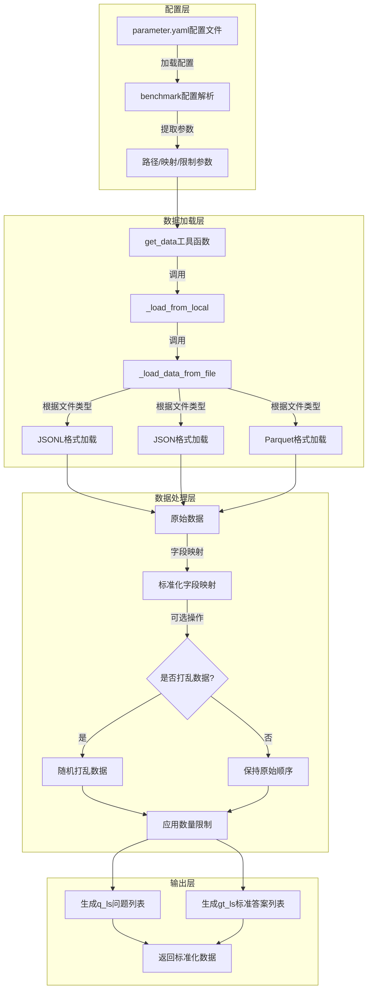

# UltraRAG Benchmark模块功能分析与工作流程

## 功能概述

Benchmark模块是UltraRAG项目中的基准测试数据加载与处理服务，主要负责：

1. **多样化数据集加载**：支持JSONL、JSON、Parquet等多种格式的基准测试数据文件
2. **数据字段映射**：通过key_map参数将原始数据字段映射为标准化格式
3. **数据预处理**：提供数据打乱（shuffle）、数量限制（limit）等预处理功能
4. **标准化输出**：将处理后的数据以统一格式（q_ls/questions和gt_ls/golden_answers）输出给评估模块
5. **错误处理与日志记录**：完善的参数验证和错误处理机制

## 高层次数据处理工作流程图

## 核心组件说明

### 1. UltraRAG_MCP_Server实例
- **app = UltraRAG_MCP_Server("benchmark")**: 初始化基准测试微服务
- 提供日志记录和异常处理机制

### 2. 数据加载函数
- **_load_data_from_file(path, limit)**: 根据文件扩展名加载不同格式的数据
- **_load_from_local(path, key_map, limit, is_shuffle, seed)**: 从本地文件加载并处理数据

### 3. 核心工具函数
- **get_data(benchmark)**: 通过@app.tool装饰器注册的主要工具函数
- 处理输入参数验证和错误处理
- 返回标准化的问答数据

### 4. 配置参数
- **name**: 基准测试名称
- **path**: 数据文件路径
- **key_map**: 字段映射关系
- **shuffle**: 是否打乱数据
- **seed**: 随机种子
- **limit**: 数据数量限制

## 工作流程详细说明

1. **配置加载阶段**：
   - 从parameter.yaml加载benchmark配置
   - 提取文件路径、字段映射、数据处理参数等

2. **数据获取阶段**：
   - 通过get_data工具函数接收配置
   - 验证参数合法性（路径、映射关系、限制值等）
   - 调用_load_from_local函数加载数据

3. **数据处理阶段**：
   - 根据文件格式选择相应的加载方法
   - 应用字段映射，将原始字段转换为标准化字段
   - 根据配置执行数据打乱和数量限制

4. **数据输出阶段**：
   - 生成q_ls（问题列表）和gt_ls（标准答案列表）
   - 返回标准化的数据供评估模块使用

## 与RAG系统的集成

Benchmark模块在RAG系统中扮演数据提供者的角色，位于评估流程的最前端：

1. 为评估模块提供标准的问答测试集
2. 确保评估过程中使用统一、可复现的测试数据
3. 通过灵活的配置支持多种基准测试场景

通过这种设计，UltraRAG可以方便地切换不同的基准测试数据集，对RAG系统进行全面、客观的评估。