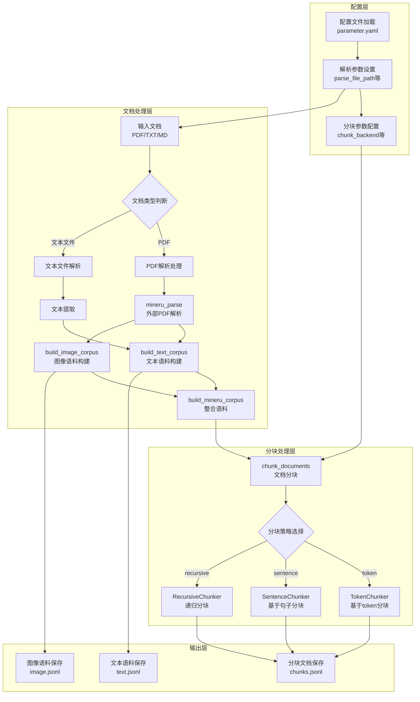

# Corpus模块功能与工作流程分析

## 功能概述

UltraRAG项目的Corpus模块是一个强大的文档处理与语料库构建系统，主要负责以下核心功能：

1. **多格式文档解析**：支持TXT、MD、PDF等多种文件格式的解析
2. **文本与图像分离提取**：从文档中分别提取文本内容和图像资源
3. **文档分块处理**：提供多种分块策略（token、sentence、recursive）
4. **语料库构建与保存**：生成结构化的文本和图像语料库
5. **外部工具集成**：支持与mineru等外部PDF解析工具的集成

## 高层次工作流程

## 核心组件说明

### 1. 配置管理
- **parameter.yaml**：定义了文件路径、解析参数和分块配置
- 关键配置项：`parse_file_path`、`chunk_backend`、`chunk_size`、`chunk_overlap`等

### 2. 文档解析组件
- **build_text_corpus**：解析并构建文本语料库，支持多种文件格式
- **build_image_corpus**：从PDF中提取图像并构建图像语料库
- **mineru_parse**：调用外部mineru工具进行高级PDF解析

### 3. 分块引擎
- **TokenChunker**：基于token数量进行文档分块
- **SentenceChunker**：基于句子边界进行分块，保留语义完整性
- **RecursiveChunker**：使用递归策略，按层次结构进行分块

### 4. 工具接口
- 所有主要功能通过@app.tool装饰器注册为工具函数，可被其他模块调用
- 支持独立运行模式(`if __name__ == "__main__": app.run(transport="stdio")`)

## 工作流程详细说明

### 1. 配置加载阶段
- 从parameter.yaml加载配置参数
- 确定输入文件路径、输出路径和分块策略

### 2. 文档解析阶段
- 根据文件类型选择相应的解析器
- 对于PDF文件，可选择使用mineru进行深度解析
- 分别提取文本内容和图像资源

### 3. 语料库构建阶段
- 将提取的内容转换为结构化格式
- 生成带有文档ID、标题和内容的标准化记录
- 分别保存文本和图像语料库

### 4. 分块处理阶段
- 根据配置选择分块策略
- 根据文本特性和需求调整分块参数
- 为每个分块生成唯一ID，并保留原始文档引用
- 应用可选的标题处理（是否将标题添加到分块内容中）

### 5. 结果保存阶段
- 将处理后的分块保存为JSONL格式
- 保留分块元数据（ID、文档来源、标题等）

## 与RAG系统的集成

Corpus模块在RAG系统中扮演着关键的文档预处理角色：

1. 为检索阶段提供结构化的文档分块
2. 支持多模态RAG（通过同时处理文本和图像）
3. 通过标准化的输出格式，确保与后续检索和生成模块的无缝集成

## 灵活性与扩展性

- **多格式支持**：适应不同类型的文档源
- **可配置分块**：根据不同模型和任务需求调整分块策略
- **外部工具集成**：通过mineru支持更复杂的文档解析需求
- **可扩展架构**：基于UltraRAG_MCP_Server，支持工具化调用和扩展