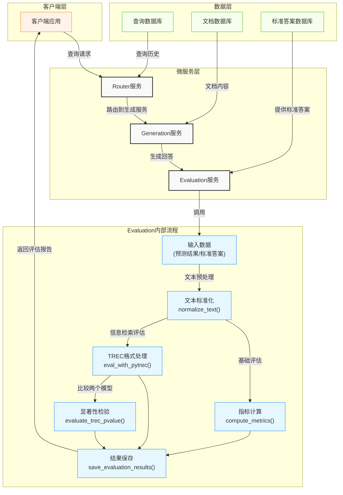

# Evaluation模块功能分析与工作流程图

## 功能概述

Evaluation模块是UltraRAG系统中的评估组件，负责对RAG系统的输出质量进行全面评估。该模块基于UltraRAG_MCP_Server构建，提供了丰富的评估指标和灵活的评估方式。

### 核心功能

1. **文本标准化处理**：提供`normalize_text`函数，支持文本清洗、转换和规范化
2. **多种评估指标计算**：
   - 准确率(accuracy)、精确匹配(exact_match)等基础指标
   - F1分数、ROUGE系列指标等高级文本质量评估
   - 信息检索评估指标(recall, precision, NDCG, MAP, MRR)等
3. **TREC格式评估**：支持标准信息检索评估格式的处理和评分
4. **显著性检验**：提供两种模型结果的显著性比较，使用排列检验方法
5. **结果可视化与保存**：生成美观的表格展示，并保存为JSON格式

## 工作流程图

## 流程说明

1. **输入阶段**：
   - 系统接收来自Generation服务的预测结果(pred_ls)
   - 从标准答案数据库获取相应的参考答案(gt_ls)
   - 可选的配置参数(metrics, ks等)

2. **文本预处理**：
   - 对预测文本和参考答案进行标准化处理
   - 包括：大小写转换、标点移除、停用词过滤、空白字符统一等

3. **指标计算**：
   - 根据指定的评估指标类型，调用相应的计算函数
   - 基础评估路径：准确率、精确匹配、F1分数、ROUGE系列
   - 信息检索评估路径：precision@k、recall@k、NDCG@k、MAP、MRR

4. **高级分析**（可选）：
   - 当需要比较两个模型性能时，执行显著性检验
   - 使用排列检验方法计算p值，判断性能差异是否显著

5. **结果输出**：
   - 格式化评估结果，生成美观的表格展示
   - 将详细结果保存为JSON文件，支持后续分析
   - 返回评估报告给客户端应用

## 主要API服务

1. **evaluate**: 基础文本评估服务，支持多种文本质量指标
2. **evaluate_trec**: 信息检索评估服务，处理标准TREC格式
3. **evaluate_trec_pvalue**: 模型比较服务，计算显著性差异

Evaluation模块在RAG工作流程中扮演着"质量把关者"的角色，为系统提供客观、全面的性能评估，帮助开发者了解系统表现并指导优化方向。