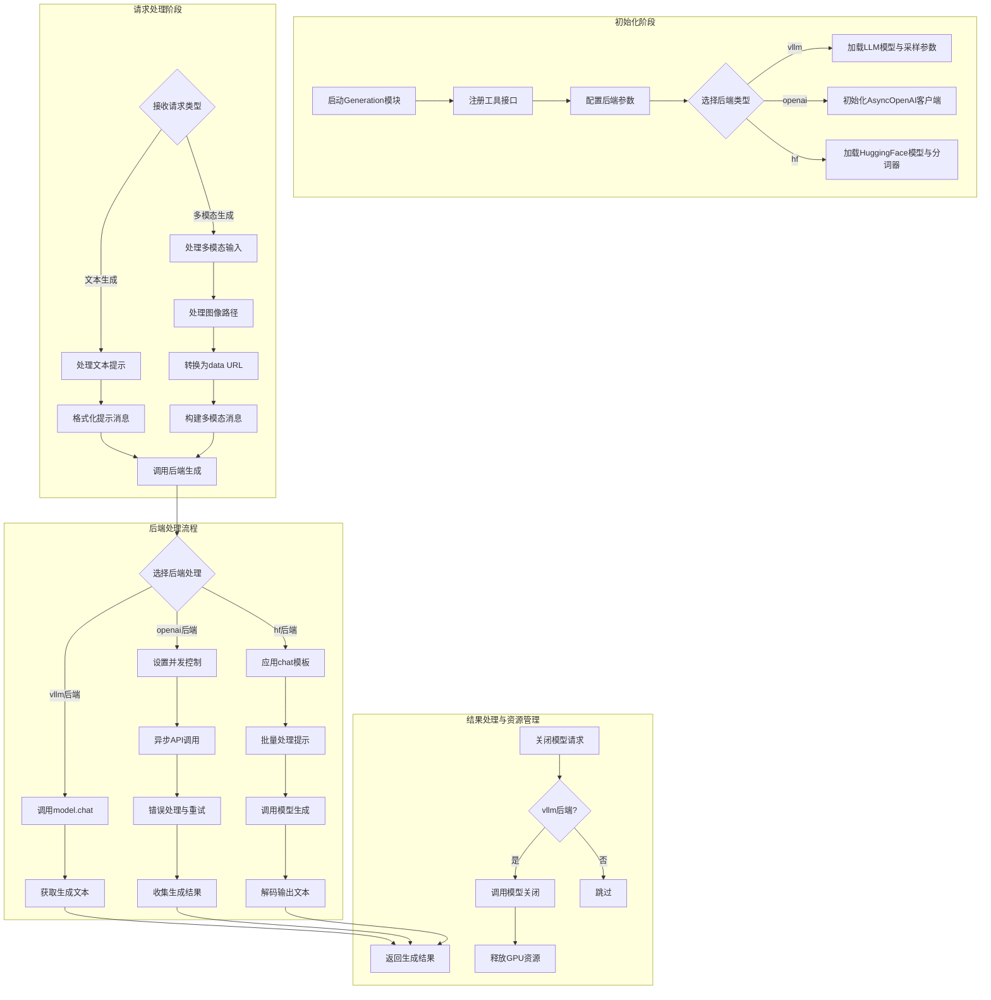

# UltraRAG 生成（Generation）模块工作流程

## 生成模块工作流程图

## 流程说明

### 1. 初始化阶段
- **启动Generation模块**：创建Generation类实例并注册工具接口
- **配置后端参数**：接收backend_configs和sampling_params参数
- **后端选择与初始化**：
  - **vllm后端**：加载LLM模型，设置GPU可见性，配置张量并行度
  - **openai后端**：初始化AsyncOpenAI客户端，设置API参数和并发控制
  - **hf后端**：加载HuggingFace模型和分词器，处理特殊token

### 2. 请求处理阶段
- **文本生成请求**：
  - 提取和标准化文本提示
  - 添加系统提示（如果提供）
  - 构建对话消息结构
- **多模态生成请求**：
  - 处理图像路径列表
  - 将图像转换为data URL格式
  - 支持两种模式：
    - 标签模式：通过image_tag替换文本中的占位符
    - 附加模式：将图像直接附加到提示前

### 3. 后端处理流程
- **vllm后端**：直接调用model.chat方法，处理批处理请求
- **openai后端**：
  - 使用信号量控制并发请求数
  - 实现重试机制处理API错误
  - 异步收集生成结果
- **hf后端**：
  - 应用chat模板格式化提示
  - 批量处理提示以提高效率
  - 调用模型生成并解码输出

### 4. 结果处理与资源管理
- 返回生成的文本结果列表
- **模型关闭流程**（主要针对vllm）：
  - 调用适当的关闭方法
  - 清理模型引用
  - 收集垃圾并释放GPU内存

## 核心特性
- **多后端支持**：灵活支持本地和云端模型
- **异步处理**：特别是针对OpenAI后端的并发优化
- **错误处理**：包含API错误重试和异常捕获
- **资源管理**：合理分配GPU资源，支持模型优雅关闭
- **多模态支持**：处理文本和图像输入，支持不同的图像嵌入模式
