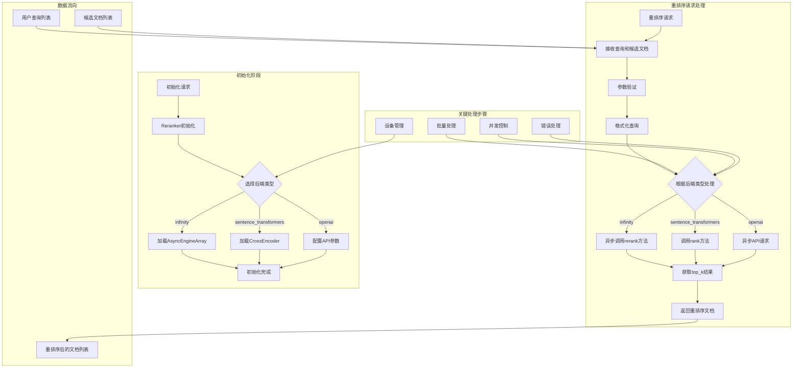

# UltraRAG 重排序模块工作流程图

## 重排序模块工作流程说明

### 初始化阶段
1. 模块通过 `reranker_init` 方法进行初始化，接收模型路径、后端配置、批量大小和GPU ID等参数
2. 根据指定的后端类型（infinity、sentence_transformers或openai），加载相应的模型或配置
3. 配置设备环境（CPU/GPU）和处理参数

### 重排序请求处理
1. 通过 `reranker_rerank` 方法接收查询列表和候选文档列表
2. 验证输入参数的有效性（查询和文档列表长度必须匹配）
3. 根据配置的后端类型，选择不同的处理路径：
   - **infinity**: 使用异步引擎进行重排序
   - **sentence_transformers**: 使用CrossEncoder进行重排序
   - **openai**: 调用外部API进行重排序
4. 对每个查询-文档对进行相关性评分，返回前top_k个最相关的文档

### 多后端支持
模块支持三种后端实现，适应不同的部署环境和性能需求：
- **infinity**: 高性能嵌入引擎，支持异步处理
- **sentence_transformers**: 基于Transformer的跨编码器，使用CPU/GPU处理
- **openai**: 基于外部API的重排序服务，支持并发控制

### 关键特性
- 异步处理：大部分操作使用异步模式，提高并发性能
- 批量处理：支持批量处理多个查询-文档对
- 并发控制：特别是在使用OpenAI后端时，通过信号量控制并发请求数
- 设备管理：根据配置选择CPU或GPU处理
- 错误处理：包含完整的参数验证和错误处理机制