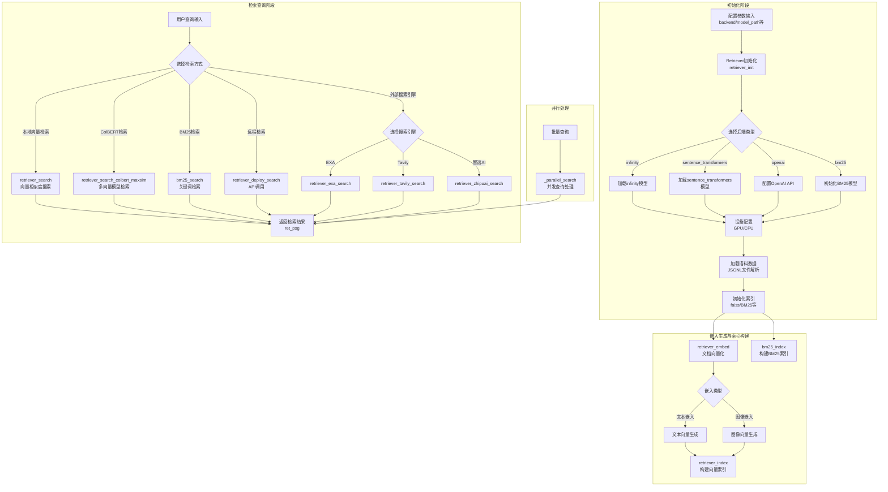

# UltraRAG 检索模块工作流程

## 检索模块高层次流程图

## 核心功能模块说明

### 1. 初始化模块 (Retriever)
- **功能**: 初始化检索系统，配置后端、加载模型和语料
- **支持的后端**: infinity、sentence_transformers、openai、bm25
- **关键配置**: 设备选择(GPU/CPU)、模型路径、语料路径

### 2. 嵌入生成模块
- **retriever_embed**: 将文本/图像转换为向量表示
- **支持**: 文本嵌入、图像嵌入、多向量模型(ColBERT/ColPali)

### 3. 索引构建模块
- **retriever_index**: 构建向量索引(faiss)
- **bm25_index**: 构建BM25关键词索引

### 4. 检索查询模块
- **本地检索**: 向量相似度搜索、ColBERT多向量检索、BM25关键词检索
- **远程检索**: 通过API调用远程检索服务
- **外部搜索引擎**: 集成EXA、Tavily、智谱AI等外部搜索服务

### 5. 并行处理模块
- **_parallel_search**: 支持批量查询的并发处理，提高检索效率

## 工作流程说明

1. **初始化流程**: 根据配置参数选择后端，加载相应模型，配置计算设备，加载语料数据，初始化索引系统
2. **向量化流程**: 将文档内容转换为向量表示，支持文本和图像两种类型
3. **索引流程**: 构建向量索引或BM25索引，为后续检索做准备
4. **检索流程**: 根据用户查询，选择合适的检索方式，返回最相关的文档段落
5. **并行处理**: 对批量查询进行并发处理，提高系统吞吐量

这个流程图展示了UltraRAG检索模块的核心工作流程，包括初始化、嵌入生成、索引构建和检索查询等关键环节，同时涵盖了多种检索后端和检索方式的集成。