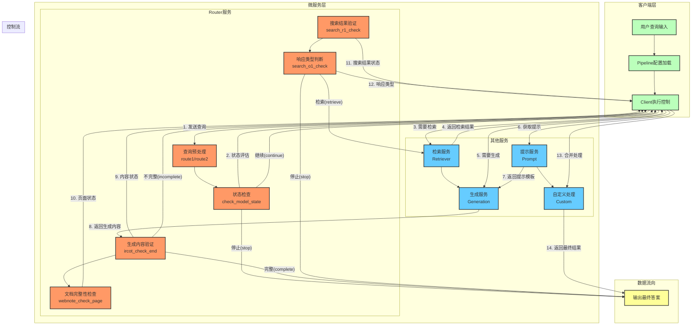

# UltraRAG Router模块工作流程分析

## Router模块功能概述

Router模块是UltraRAG系统中的关键控制组件，主要负责流程控制、状态检查和路由分发。通过分析代码，该模块提供了以下核心功能：

1. **查询路由功能**：`route1`和`route2`函数根据输入查询特征将请求路由到不同的处理路径
2. **状态检查功能**：多个检查函数用于评估生成内容或文档的完成状态，决定后续处理流程
3. **条件分支控制**：通过状态标记（如"complete"/"incomplete"、"continue"/"stop"）控制RAG流程的执行路径

## 高层次数据处理与文档解析工作流程图

## 流程说明

1. **初始化阶段**：
   - 用户查询输入到系统
   - 客户端加载Pipeline配置，初始化各服务连接
   - Client组件作为中央控制器协调各服务工作

2. **路由分发阶段**：
   - Router服务的`route1`/`route2`函数对查询进行预处理和分类
   - 根据查询特征和内容，为每个查询分配不同的处理状态

3. **状态控制阶段**：
   - `check_model_state`函数检查生成内容中是否包含搜索指令
   - 根据检查结果决定是继续检索还是停止流程

4. **检索与生成阶段**：
   - 当需要检索时，Client调用Retriever服务获取相关文档
   - 获取提示词模板后，调用Generation服务生成回答

5. **验证与反馈阶段**：
   - 多个检查函数验证生成内容的完整性和状态
   - 验证结果反馈给Client，决定是继续迭代还是返回最终结果

6. **结束阶段**：
   - 当内容被标记为完整或流程需要停止时，组装最终答案返回给用户

## Router模块的关键作用

Router模块在整个RAG流程中扮演着"决策中心"的角色，通过：

1. **动态流程控制**：根据中间结果动态调整执行路径
2. **状态监控**：持续监控生成内容和检索结果的状态
3. **迭代控制**：决定何时继续检索、何时停止流程
4. **质量把关**：确保返回给用户的内容完整且符合要求

这种设计使得UltraRAG系统能够灵活应对复杂的检索增强生成任务，实现高效的多轮迭代处理。