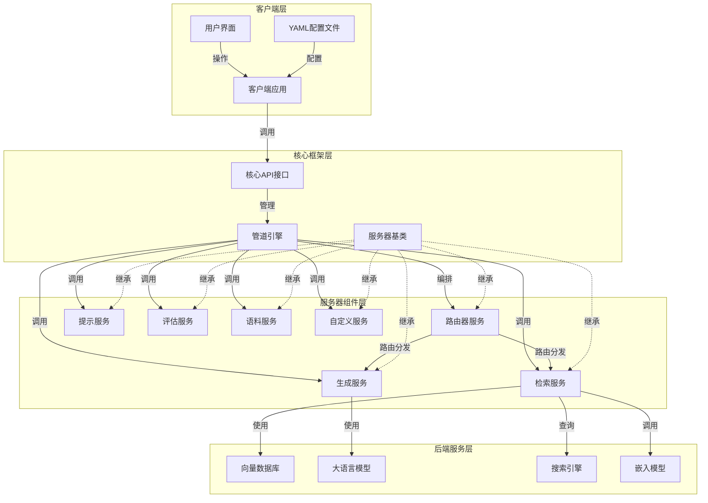
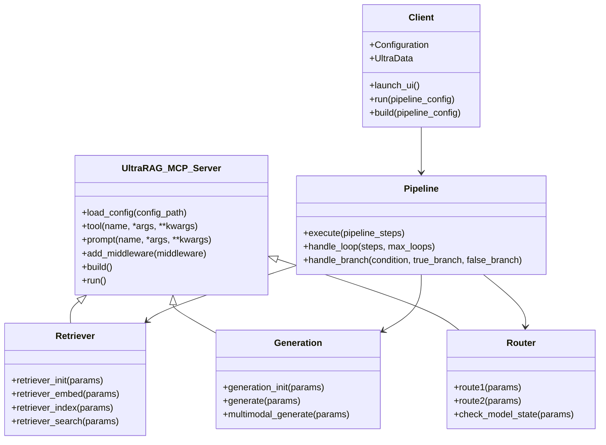
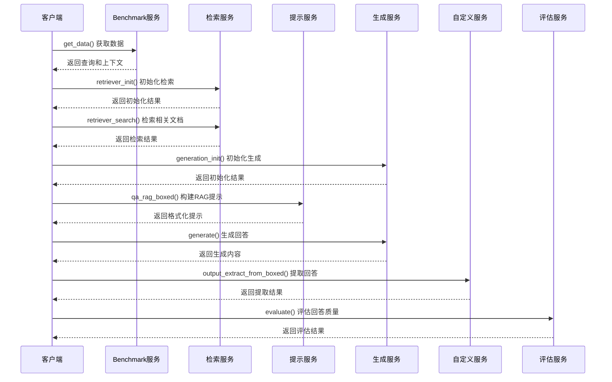
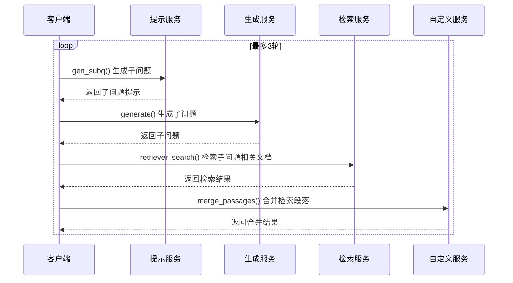

# UltraRAG 技术架构分析报告

## 1. 项目概述

UltraRAG是一个高性能、模块化的检索增强生成（RAG）系统框架，采用基于微服务通信协议（MCP）的分布式架构设计。该系统通过声明式流程编排，使开发者能够以低代码方式构建和配置复杂的RAG应用。UltraRAG支持多种检索后端、生成模型和工作流程模式，具备高度的灵活性和可扩展性。

### 1.1 核心特性
- **模块化架构**：基于MCP的微服务设计，各功能组件独立部署运行
- **声明式流程编排**：通过YAML配置文件定义复杂的RAG工作流程
- **多后端支持**：兼容多种向量检索、文本生成和搜索引擎服务
- **多模态能力**：支持文本、图像等多种模态的RAG应用
- **异步编程模型**：基于asyncio的高效并发处理

## 2. 系统架构

UltraRAG采用基于FastMCP的分布式组件架构，由核心框架层、服务器组件层和应用层组成。系统通过统一的通信协议连接各个独立运行的服务组件，实现高度解耦的架构设计。

### 2.1 整体架构图



### 2.2 模块关系图



## 3. 核心组件分析

### 3.1 核心框架组件

#### 3.1.1 API接口层
- **initialize**：初始化MCP服务器
- **_CallWrapper**：工具调用包装器
- **_ServerProxy**：服务器代理，用于远程调用服务器方法
- **_Router**：路由分发器，管理请求路由
- **ToolCall**：工具调用对象，封装调用参数和返回值
- **PipelineCall**：管道调用函数，执行完整RAG流程

#### 3.1.2 服务器基类
- **UltraRAG_MCP_Server**：继承自FastMCP，提供服务器基类功能
  - **load_config**：加载配置文件
  - **tool**：注册工具方法
  - **prompt**：注册提示模板
  - **build**：构建服务器
  - **run**：运行服务器

#### 3.1.3 客户端组件
- **launch_ui**：启动用户界面
- **Configuration**：配置管理类
- **UltraData**：数据处理类
- **parse_path**：路径解析函数
- **elem_match**：数据匹配函数
- **run**：异步运行管道
- **build**：异步构建管道

### 3.2 服务器组件

#### 3.2.1 Retriever服务器
- **功能**：负责文档嵌入、索引和检索
- **后端支持**：infinity、sentence_transformers、openai、bm25
- **主要工具**：
  - **retriever_init**：初始化检索后端
  - **retriever_embed**：嵌入文档
  - **retriever_index**：构建索引
  - **retriever_search**：执行检索
- **特点**：支持本地检索和外部搜索引擎（Exa、Tavily、智谱AI）

#### 3.2.2 Generation服务器
- **功能**：负责文本和多模态内容生成
- **后端支持**：vllm、openai、huggingface
- **主要工具**：
  - **generation_init**：初始化生成模型
  - **generate**：生成文本内容
  - **multimodal_generate**：生成多模态内容
- **特点**：支持文本提示提取、图像转data URL

#### 3.2.3 Router服务器
- **功能**：负责流程控制和路由分发
- **主要工具**：
  - **route1/route2**：路由分发方法
  - **check_model_state**：检查模型状态
  - **ircot_check_end**：检查回答是否完成
- **特点**：通过状态标记（"complete"/"incomplete"、"stop"/"retrieve"）实现流程编排

## 4. 核心业务流程

### 4.1 基础RAG流程



### 4.2 循环RAG流程



### 4.3 条件分支RAG流程

```mermaid
sequenceDiagram
    participant Client as 客户端
    participant Router as 路由服务
    participant Prompt as 提示服务
    participant Generation as 生成服务
    participant Retriever as 检索服务
    participant Custom as 自定义服务

    loop 循环直到条件满足
        Client->>Router: check_model_state() 检查状态
        Router-->>Client: 返回状态（continue/stop）
        
        alt 继续检索（continue）
            Client->>Prompt: gen_subq() 生成子问题
            Prompt-->>Client: 返回子问题提示
            
            Client->>Generation: generate() 生成子问题
            Generation-->>Client: 返回子问题
            
            Client->>Retriever: retriever_search() 检索文档
            Retriever-->>Client: 返回检索结果
            
            Client->>Custom: merge_passages() 合并段落
            Custom-->>Client: 返回合并结果
        else 停止检索（stop）
            break 跳出循环
        end
    end
```

## 5. 关键设计模式

### 5.1 MCP架构
基于微服务通信协议的分布式架构，实现了服务间的标准化通信，降低了组件间耦合。

### 5.2 组件化设计
每个功能模块（检索、生成、提示等）被封装为独立的服务器组件，可以独立开发、部署和扩展。

### 5.3 声明式流程编排
通过YAML配置文件定义流程，分离了业务逻辑和技术实现，降低了开发复杂度。

### 5.4 插件化设计
支持通过继承UltraRAG_MCP_Server类轻松创建自定义服务器组件。

### 5.5 异步编程模式
采用asyncio实现异步操作，提高了系统并发性能和资源利用率。

## 6. 技术栈分析

### 6.1 核心技术
- **Python**：主要开发语言
- **FastMCP**：微服务通信协议框架
- **asyncio**：异步编程库
- **YAML**：配置文件格式

### 6.2 可选依赖
- **retriever依赖**：sentence-transformers, faiss, chromadb等
- **generation依赖**：vllm, openai, transformers等
- **corpus依赖**：pypdf, docx2txt等

### 6.3 支持的后端
- **检索后端**：sentence_transformers, infinity, openai, bm25
- **生成后端**：vllm, openai, huggingface
- **搜索引擎**：Exa, Tavily, 智谱AI

## 7. 架构评估

### 7.1 架构设计优点
- **高度解耦**：基于MCP的模块化架构，实现关注点分离
- **灵活性**：声明式流程编排，支持复杂流程控制
- **可扩展性**：插件化设计，易于添加新功能
- **多后端支持**：兼容多种检索和生成模型
- **高效并发**：异步编程模型，提高系统性能

### 7.2 架构设计缺点
- **配置复杂度**：配置文件分散，学习曲线较陡
- **错误处理机制**：异常处理和故障恢复机制不够完善
- **性能优化空间**：缺少缓存机制和资源管理优化
- **扩展性限制**：新后端集成需要修改现有代码
- **监控和日志**：监控机制和日志管理不够完善

## 8. 改进建议

### 8.1 配置管理优化
- 提供集中式配置管理和验证工具
- 创建常用场景的配置模板
- 支持运行时动态调整配置

### 8.2 错误处理增强
- 实现全局异常处理框架
- 添加智能重试策略
- 改进错误隔离机制
- 提供更友好的错误信息

### 8.3 性能优化
- 实现多级缓存机制
- 改进批处理策略
- 实现计算资源的池化管理
- 采用懒加载策略

### 8.4 可观测性提升
- 集成分布式追踪系统
- 提供可视化监控面板
- 改进日志格式和分析能力
- 集成性能分析工具

### 8.5 安全性增强
- 实现细粒度的访问控制
- 改进敏感信息保护
- 加强输入数据验证

## 9. 总结

UltraRAG是一个设计精良的RAG系统框架，通过基于MCP的模块化架构和声明式流程编排，实现了高度灵活、可扩展的RAG应用开发平台。系统的多后端支持和多模态能力使其能够适应各种复杂的应用场景。虽然在配置管理、错误处理和性能优化方面仍有改进空间，但整体架构设计符合现代分布式系统的最佳实践，为RAG应用的开发和部署提供了坚实的基础。

通过实施建议的改进措施，UltraRAG有望在保持现有灵活性和扩展性的同时，进一步提升系统的稳定性、性能和用户体验，使其成为更加强大和易用的RAG系统框架。